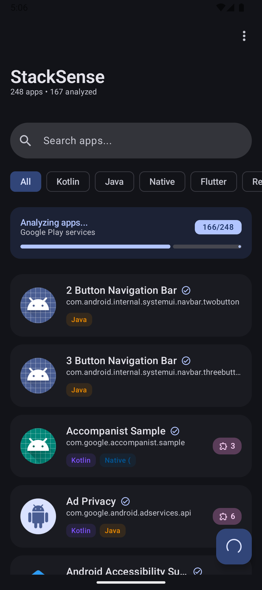
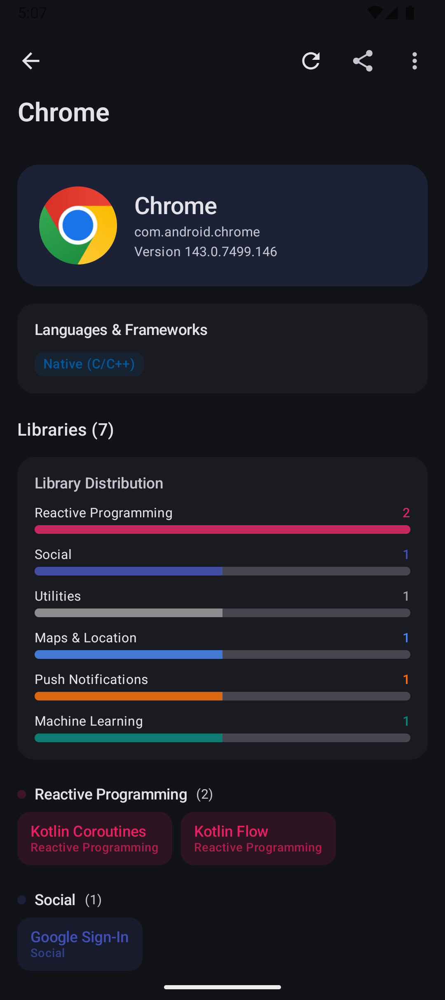
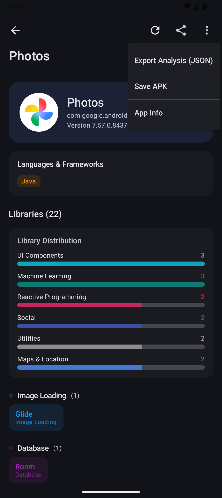

# StackSense 🔍

<div align="center">


**Analyze installed Android apps to discover their programming languages, cross-platform frameworks, and third-party libraries.**
*Reverse-engineer your app ecosystem. 100% Offline.*

[](https://kotlinlang.org)
[](https://developer.android.com/jetpack/compose)
[](https://m3.material.io/)
[](https://android-arsenal.com/api?level=26)
[](LICENSE)

**✈️ Works 100% Offline - No Internet Required**

</div>

---

## ✨ Features

| Feature | Description |
|---------|-------------|
| 📱 **App List** | View all installed apps in a beautiful Material 3 list |
| 🔍 **Search** | Filter apps by name or package |
| 🏷️ **Language Detection** | Identify Kotlin, Java, and Native (C/C++) code |
| 🌐 **Cross-Platform Detection** | Detect Flutter, React Native, Xamarin, Unity, Cordova, Qt, KMP |
| 📚 **Library Detection** | Detect 50+ popular Android libraries |
| 🎨 **Material You** | Dynamic theming based on your wallpaper (Android 12+) |
| 🌙 **Dark Mode** | Full dark mode support |
| 🛡️ **Permissions** | View detailed requested permissions list |
| 📊 **Export** | Export analysis to JSON or save APK to device |
| 📤 **Share** | Share analysis results as text |
| ✈️ **Offline** | Works completely offline |

---

## 📸 Screenshots

<div align="center">
  
  
  
</div>

---

## 🔬 How It Works

StackSense analyzes APK files locally on your device without requiring any internet connection:

### Language Detection
- **Kotlin**: Scans for `kotlin/Metadata` entries in DEX files
- **Java**: Default for JVM bytecode without Kotlin markers
- **Native**: Checks for `.so` files in `lib/` directories

### Cross-Platform Framework Detection
| Framework | Detection Method |
|-----------|-----------------|
| **Flutter** | `libflutter.so` + `flutter_assets/` folder |
| **React Native** | `libreactnativejni.so` + `index.android.bundle` |
| **Xamarin** | `libmonodroid.so` + Mono assemblies |
| **Cordova/Ionic** | `www/` folder with `cordova.js` |
| **Unity** | `libunity.so` + `assets/bin/Data/` |
| **Qt** | `libQt5Core.so` or `libQt6Core.so` |
| **Kotlin Multiplatform** | `kotlinx/` packages with common modules |

### Library Detection
Scans DEX files for known package prefixes of 50+ popular libraries:

<details>
<summary>📚 Detectable Libraries</summary>

#### Networking
- Retrofit, OkHttp, Volley, Ktor, Apollo GraphQL

#### Image Loading
- Glide, Coil, Picasso, Fresco

#### Dependency Injection
- Hilt, Dagger, Koin, Toothpick

#### Database
- Room, Realm, SQLDelight, greenDAO

#### Reactive Programming
- RxJava 2/3, Kotlin Coroutines, Kotlin Flow

#### Analytics
- Firebase Analytics, Google Analytics, Amplitude, Mixpanel, Segment

#### Advertising
- AdMob, Facebook Audience Network, Unity Ads, AppLovin, ironSource

#### UI Components
- Lottie, Epoxy, Material Components, PhotoView

#### Serialization
- Gson, Moshi, Kotlinx Serialization, Jackson

#### Crash Reporting
- Firebase Crashlytics, Sentry, Bugsnag, Instabug

#### Logging
- Timber, Logger

#### Architecture
- Orbit MVI, Mavericks

#### Security
- AndroidX Security, Tink

#### And many more...

</details>

---

## 🛠 Tech Stack

| Category | Technology |
|----------|------------|
| **Language** | Kotlin 2.1 |
| **UI Framework** | Jetpack Compose |
| **Design System** | Material 3 (Material You) |
| **Architecture** | MVVM + Clean Architecture |
| **Dependency Injection** | Hilt |
| **Navigation** | Compose Navigation |
| **Async** | Kotlin Coroutines + Flow |
| **Image Loading** | Coil 3 |
| **Min SDK** | API 26 (Android 8.0) |
| **Target SDK** | API 35 |

---

## 📦 Project Structure

```
app/src/main/java/com/stacksense/
├── di/                    # Hilt dependency injection
│   └── AppModule.kt
├── data/
│   ├── model/            # Data classes
│   │   └── AppModels.kt
│   ├── repository/       # Data sources
│   │   └── AppRepository.kt
│   ├── export/           # Export & file handling
│   │   └── AnalysisExporter.kt
│   └── analyzer/         # APK analysis logic
│       ├── ApkAnalyzer.kt
│       └── LibrarySignatures.kt
├── ui/
│   ├── theme/            # Material 3 theming
│   │   ├── Theme.kt
│   │   └── Type.kt
│   ├── components/       # Reusable composables
│   │   ├── AppCard.kt
│   │   └── LibraryChip.kt
│   ├── screens/
│   │   ├── home/         # Main app list
│   │   │   ├── HomeScreen.kt
│   │   │   └── HomeViewModel.kt
│   │   └── detail/       # App details
│   │       ├── DetailScreen.kt
│   │       └── DetailViewModel.kt
│   └── navigation/       # Navigation setup
│       └── AppNavigation.kt
├── StackSenseApplication.kt
└── MainActivity.kt
```

---

## 🚀 Getting Started

### Prerequisites
- Android Studio Ladybug (2024.2.1) or newer
- JDK 17+
- Android SDK 35

### Build Instructions

1. **Clone the repository**
   ```bash
   git clone https://github.com/yourusername/StackSense.git
   cd StackSense
   ```

2. **Open in Android Studio**
   - File → Open → Select the StackSense folder

3. **Build the project**
   ```bash
   ./gradlew assembleDebug
   ```

4. **Install on device**
   ```bash
   ./gradlew installDebug
   ```

---

## ⚠️ Permissions

This app requires the `QUERY_ALL_PACKAGES` permission to scan installed applications.

> **Note**: Due to Google Play policies, apps using this permission must declare a valid use case. This app is intended for personal/educational use to understand app technologies.

---

## 🤝 Contributing

Contributions are welcome! Please feel free to submit a Pull Request.

1. Fork the repository
2. Create your feature branch (`git checkout -b feature/AmazingFeature`)
3. Commit your changes (`git commit -m 'Add some AmazingFeature'`)
4. Push to the branch (`git push origin feature/AmazingFeature`)
5. Open a Pull Request

---

## 📄 License

This project is licensed under the MIT License - see the [LICENSE](LICENSE) file for details.

---

## 🙏 Acknowledgments

- [Jetpack Compose](https://developer.android.com/jetpack/compose) - Modern Android UI toolkit
- [Material 3](https://m3.material.io/) - Design system by Google
- [Hilt](https://dagger.dev/hilt/) - Dependency injection
- All the amazing open-source libraries that make Android development better

---

<div align="center">

Made with ❤️ using Kotlin & Jetpack Compose

**If you found this project helpful, please ⭐ the repository!**

</div>
